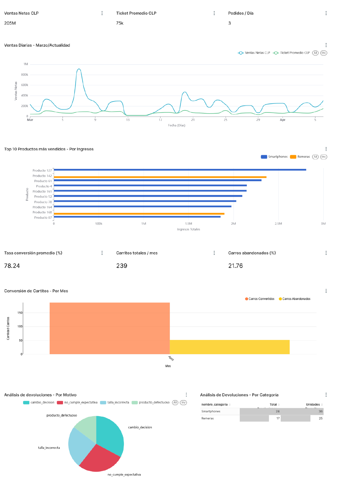
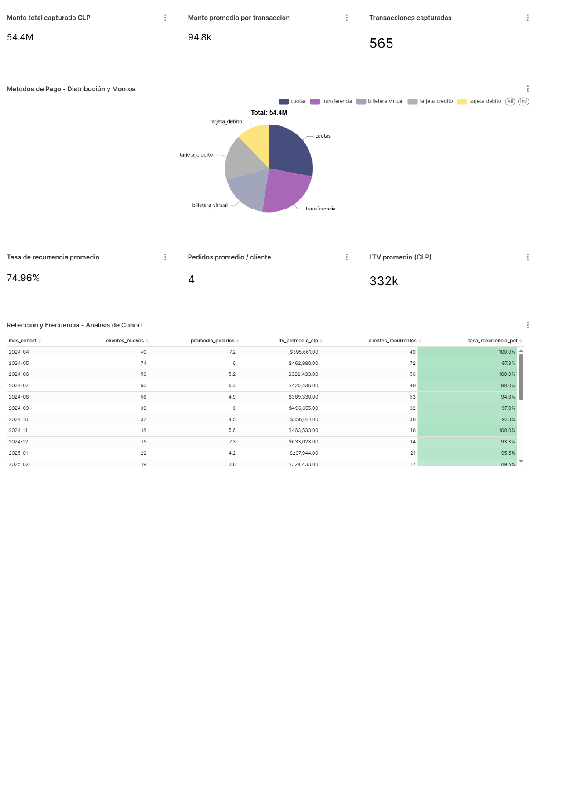

# 🛒 Ecommerce BI Platform — Portafolio de Datos End-to-End

> Una plataforma de análisis de datos completa para un ecommerce chileno, construida 100% con herramientas open source. Genera datos realistas, los transforma en tiempo real y los visualiza en un dashboard listo para usar.


---

## ¿Qué hace este proyecto?

Este proyecto simula el ciclo de vida completo de los datos en un ecommerce: desde que un cliente hace un pedido, hasta que ese dato aparece en un dashboard ejecutivo.

**En concreto:**

1. **Genera transacciones automáticamente** — Un simulador asíncrono crea compras, pagos, devoluciones, envíos y carritos con datos realistas de Chile (IVA 19%, comunas, Transbank, Chilexpress).
2. **Procesa los datos en tiempo real** — Cada transacción dispara un evento que el motor OLAP recibe via `LISTEN/NOTIFY` nativo de PostgreSQL — sin Kafka, sin brokers externos.
3. **Carga un Data Warehouse** — Los eventos se transforman y cargan en un modelo Star Schema Kimball con 5 fact tables y dimensiones con historial SCD Tipo 2.
4. **Visualiza todo en un dashboard** — Apache Superset muestra 10 métricas de negocio: ventas, productos, carritos, transportistas, devoluciones, pagos, retención y más.

**Flujo de datos:** `OLTP Simulator → eventos_negocio → OLAP Processor → Star Schema → Superset`

---

## ⚠️ Requisito obligatorio: Docker

**Este proyecto requiere Docker para funcionar.** No necesitas instalar Python, PostgreSQL ni ninguna otra dependencia — Docker se encarga de todo.

- Descarga Docker Desktop: [https://www.docker.com/products/docker-desktop](https://www.docker.com/products/docker-desktop)
- Versión mínima: **Docker Compose v2+**
- RAM recomendada: **4 GB libres** (Apache Superset es el componente más pesado)

---

## 🚀 Inicio rápido (3 comandos)

```bash
# 1. Clona el repositorio
git clone https://github.com/bcuyul/EcommerceCL.git
cd ecommercecl/easy_mode

# 2. Levanta toda la plataforma
docker compose up -d

# 3. Abre el dashboard
# http://localhost:8088  →  admin / admin
```

> La primera vez puede tardar un poco más mientras Docker descarga las imágenes (~1.5 GB).

---

## 📊 Dashboard en acción

Las siguientes capturas muestran el dashboard funcionando con datos reales generados por el simulador.

### Página 1 — Ventas, Productos, Carritos y Devoluciones



> **KPIs visibles:** Ventas Netas CLP 205M · Ticket Promedio 75k · Pedidos/Día 3 · Tasa de conversión de carritos 78.24% · Carros abandonados 21.76%

**Gráficos incluidos:**
- 📈 **Ventas Diarias** — Evolución de ventas netas y ticket promedio desde marzo a la fecha (Q1)
- 📊 **Top 10 Productos por Ingresos** — Barras horizontales con Smartphones y Remeras como categorías dominantes (Q2)
- 🛒 **Conversión de Carritos por Mes** — Carritos convertidos vs abandonados, con tasa de conversión del 78% (Q3)
- 🔄 **Análisis de Devoluciones** — Pie chart por motivo y tabla por categoría de producto (Q5)

---

### Página 2 — Pagos, Retención y Cohort



> **KPIs visibles:** Monto total capturado 54.4M CLP · Monto promedio por transacción 94.8k · 565 transacciones · Tasa de recurrencia 74.96% · LTV promedio 332k CLP

**Gráficos incluidos:**
- 💳 **Métodos de Pago** — Distribución y montos de 5 métodos: cuotas, transferencia, billetera, tarjeta crédito/débito (Q7)
- 👥 **Análisis de Cohort** — Retención y frecuencia de compra por mes de primer pedido, desde abril 2024 (Q10)

---

## 🔑 Credenciales de acceso

| Servicio | Usuario | Contraseña | URL / Puerto |
|---|---|---|---|
| **Dashboard (Superset)** | `admin` | `admin` | `http://localhost:8088` |
| **Base de datos** | `postgres` | `postgres` | `localhost:5433` |
| **Usuario app** | `ecommerce` | `ecommerce123` | — |
| **Usuario BI completo** | `pbi_analytical` | `data_pbi_123` | — |
| **Usuario BI ejecutivo** | `pbi_executive` | `exec_pbi_123` | — |

> Recomendamos usar el usuario `postgres` en Superset para acceder a todas las tablas y vistas sin restricciones durante el desarrollo.

---

## 📐 Las 10 consultas BI del portafolio

Todas las consultas operan sobre el schema `warehouse` y están listas para usar en Superset SQL Lab o como datasets de charts.

| # | Consulta | Gráfico | Fuente de datos |
|---|---|---|---|
| Q1 | Ventas Diarias | Line Chart | `fact_pedidos + dim_fecha` |
| Q2 | Top 10 Productos por Ingresos | Bar Chart horizontal | `fact_detalle_pedidos + dim_producto` |
| Q3 | Tasa de Conversión de Carritos | Bar + Line combo | `fact_carritos + dim_fecha` |
| Q4 | Performance de Transportistas | Table con color condicional | `fact_envios + dim_almacen` |
| Q5 | Análisis de Devoluciones | Pie Chart + Table | `fact_devoluciones + dim_producto` |
| Q6 | Ticket Promedio por Canal | Bar Chart / KPI Cards | `fact_pedidos + dim_canal` |
| Q7 | Métodos de Pago | Pie Chart / Donut | `fact_pagos + dim_metodo_pago` |
| Q8 | Segmentación de Clientes | Bar Chart / Treemap | `dim_cliente + fact_pedidos` |
| Q9 | Rotación de Inventario | Grouped Bar / Heatmap | `fact_movimientos_inventario + dim_almacen` |
| Q10 | Retención y Cohort | Table con formato condicional | `fact_pedidos + dim_fecha (CTE)` |

---

## 🗂️ Estructura del proyecto

```
ecommerce_cl/
├── easy_mode/              ← 👈 Empieza aquí (Docker, 1 comando)
│   ├── init/               ← Scripts SQL ejecutados en orden automático
│   │   ├── 00_bootstrap.sql   — Roles y extensiones
│   │   ├── 01_oltp.sql        — Schema transaccional completo
│   │   ├── 02_warehouse.sql   — Star Schema Kimball
│   │   ├── 03_auth.sql        — Autenticación bcrypt
│   │   ├── 04_rbac.sql        — Permisos por rol
│   │   └── 05_views.sql       — Vistas analíticas
│   ├── superset/           ← Configuración de Apache Superset
│   ├── docker-compose.yml
│   ├── Dockerfile.platform
│   └── wait_for_db.py
├── python/                 ← Simulador OLTP + Procesador OLAP
│   └── run_platform_v5.py
└── docs/                   ← Arquitectura, decisiones y troubleshooting
    └── img/                ← Capturas del dashboard
```

---

## 🧱 Tecnologías usadas

| Componente | Tecnología | ¿Para qué? |
|---|---|---|
| Base de datos | PostgreSQL 15 | OLTP + Data Warehouse en el mismo motor |
| Pipeline | Python 3.11 (asyncio + asyncpg) | Simulador y procesador de eventos asíncronos |
| Mensajería | PostgreSQL LISTEN/NOTIFY | Streaming de eventos sin brokers externos |
| Data Warehouse | Star Schema Kimball | 5 fact tables, 8 dimensiones, SCD Tipo 2 |
| Dashboard | Apache Superset 3.1 | Visualización con DirectQuery y RBAC |
| Caché | Redis 7 | Acelera las consultas en Superset |
| Infraestructura | Docker Compose | Levanta los 5 servicios con un comando |

---

## 🔐 Seguridad — RBAC en dos capas

La seguridad opera en dos niveles independientes:

**Capa 1 — PostgreSQL:** Cada rol de base de datos tiene acceso solo a los objetos que necesita:
- `ecommerce` → acceso completo a OLTP y warehouse (simulador y procesador)
- `pbi_analytical` → solo `SELECT` en todas las tablas del schema `warehouse`
- `pbi_executive` → solo `SELECT` en las vistas `warehouse.vw_*`

**Capa 2 — Apache Superset:** Los usuarios de Superset tienen roles Alpha/Gamma que controlan qué pueden ver y crear en la interfaz.

Los dashboards nunca se conectan directamente a las tablas OLTP del schema `public`.

---

## ⚙️ Configuración del simulador

El simulador genera tráfico con esta distribución de probabilidades:

| Acción | Probabilidad | Qué genera |
|---|---|---|
| Nuevo pedido | 30% | Pedido con 1–4 productos, IVA 19% |
| Avanzar estado | 25% | Ciclo pendiente → entregado |
| Procesar pago | 18% | Transbank, Flow, Khipu (92% éxito) |
| Reponer stock | 8% | Orden de compra con proveedor |
| Carrito | 5% | 65% se convierte, 35% se abandona |
| Cancelar pedido | 5% | Revierte reserva de stock |
| Actualizar envío | 5% | Marca entregado, calcula días |
| Devolución | 4% | Mueve stock, marca envío 'devuelto' |

Parámetros configurables en `docker-compose.yml` vía variables de entorno:

```yaml
OLTP_INTERVAL_MIN: "1.5"    # segundos entre eventos (mínimo)
OLTP_INTERVAL_MAX: "3.5"    # segundos entre eventos (máximo)
OLTP_MAX_PEDIDOS: "100000"  # límite de pedidos antes de pausar
PROB_CARRITO_CONVERSION: "0.65"  # probabilidad de conversión de carrito
```

---

## 📖 Documentación técnica

- [Guía de inicio rápido (easy_mode)](./easy_mode/README.md)
- [Informe técnico completo v4 (PDF)](./docs/ecommerce_bi_platform_v4_informe.pdf)
- [Arquitectura del sistema](./docs/arquitectura_v3.md)
- [Decisiones de diseño](./docs/decision_log.md)
- [Errores corregidos v4](./docs/bugfix_log.md)
- [Solución de problemas comunes](./docs/troubleshooting.md)

---

## ❓ Preguntas frecuentes

**¿Por qué PostgreSQL en lugar de un data warehouse dedicado (Snowflake, BigQuery)?**
Para un volumen de ecommerce mediano, PostgreSQL con el schema `warehouse` separado del OLTP es más que suficiente y elimina cualquier costo de infraestructura. El patrón es fácilmente migrable a un warehouse dedicado si el volumen crece.

**¿Por qué LISTEN/NOTIFY en lugar de Kafka?**
Kafka añade complejidad operacional significativa para un volumen que PostgreSQL maneja cómodamente. LISTEN/NOTIFY es nativo, confiable y no requiere ningún servicio adicional. El polling de seguridad cada 2 segundos garantiza que ningún evento se pierda.

**¿Puedo conectar Power BI en lugar de Superset?**
Sí. Power BI puede conectarse directamente a PostgreSQL usando el conector nativo. Las consultas SQL del portafolio funcionan igual en cualquier herramienta BI.

---

*Proyecto de portafolio — Brayan Cuyul · [github.com/bcuyul/EcommerceCL](https://github.com/bcuyul/EcommerceCL)*
