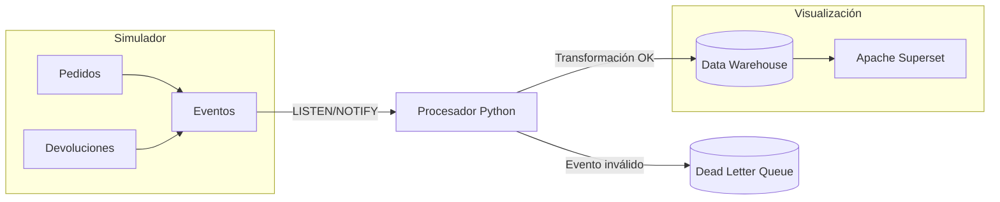

# Cómo funciona la plataforma — Arquitectura

Este documento explica cómo están conectadas las piezas del proyecto. No necesitas ser ingeniero de datos para entenderlo — pero si lo eres, también encontrarás las decisiones técnicas detrás de cada elección.

---

## La idea general

El proyecto simula lo que haría una empresa de ecommerce real para convertir sus transacciones diarias en información útil para tomar decisiones.

El flujo tiene tres etapas:

```
Pedidos → Procesamiento → Dashboard
(OLTP)      (ETL/Python)     (Superset)
```

Cada vez que el simulador genera un pedido, ese evento viaja por el pipeline y termina actualizado en el dashboard. Todo ocurre en tiempo real, sin intervención manual.

---

## Los 4 componentes

### 1. El Simulador de Pedidos

Genera tráfico transaccional de forma continua y automática. Crea pedidos, ventas, devoluciones y envíos con datos realistas de Chile: comunas, regiones, y medios de pago locales como Transbank o Flow.

Técnicamente usa Python con programación asíncrona (`asyncio`), lo que le permite procesar muchos eventos al mismo tiempo sin consumir demasiada memoria.

### 2. El Procesador en Tiempo Real

Es el motor central del proyecto. Escucha cada nuevo pedido que genera el simulador y lo transforma para dejarlo listo para el análisis.

¿Cómo se entera de los nuevos pedidos? PostgreSQL tiene una funcionalidad llamada `LISTEN/NOTIFY` que funciona como un canal de mensajes interno: cuando se inserta un pedido, la base de datos avisa al procesador automáticamente.

Si algo falla en la transformación de un evento (por ejemplo, un dato inválido), ese evento se guarda en una **Dead Letter Queue (DLQ)** en lugar de bloquear todo el pipeline. Puedes revisarlo después con una consulta SQL simple.

### 3. El Data Warehouse

Es donde viven los datos listos para el análisis. Usa un modelo llamado **Star Schema** (o esquema estrella), que es el estándar de la industria para construir reportes rápidos.

La idea es simple: hay una tabla central con los hechos (pedidos, ventas) rodeada de tablas de dimensiones (clientes, productos, fechas, regiones). Esto hace que las consultas analíticas sean mucho más rápidas que consultar las tablas operacionales directamente.

Una característica especial: los productos y almacenes usan **SCD Tipo 2**, que significa que el sistema guarda el historial de cambios. Si hoy cambias el nombre de un producto, los reportes de ventas de ayer seguirán mostrando el nombre anterior. Eso es importante para cuadrar cifras históricas.

### 4. El Dashboard (Apache Superset)

Apache Superset es la plataforma de visualización — comparable a Power BI o Tableau, pero gratuita y open source. Consulta los datos directamente desde el Data Warehouse sin necesidad de exportar archivos.

El acceso está controlado por roles: el usuario `pbi_executive` solo puede ver las vistas analíticas preparadas, no las tablas internas del sistema.

---

## Diagrama de flujo



---

## Seguridad y accesos

El sistema tiene tres roles de base de datos con permisos diferentes:

| Rol | Acceso |
|---|---|
| `ecommerce` | Lectura y escritura completa (lo usa el pipeline) |
| `pbi_analytical` | Lectura de todo el Data Warehouse |
| `pbi_executive` | Solo las vistas analíticas preparadas (sin acceso a tablas internas) |

Los usuarios de la aplicación se autentican con contraseñas hasheadas (bcrypt) y el sistema bloquea una cuenta automáticamente tras 5 intentos fallidos.

---

## ¿Por qué estas tecnologías?

Las decisiones principales están documentadas en el [Decision Log](./decision_log.md). El resumen rápido:

- **PostgreSQL en lugar de Kafka** → Menos complejidad para un ecommerce mediano. Un solo servicio gestiona tanto las transacciones como el pipeline de eventos.
- **Python asíncrono** → Puede manejar cientos de eventos por segundo con muy poca memoria.
- **Star Schema (Kimball)** → Estándar probado para analytics. Las consultas son rápidas y el modelo es fácil de entender.
- **Docker** → Cualquier persona puede levantar el proyecto completo en un solo comando, sin configurar entornos locales.